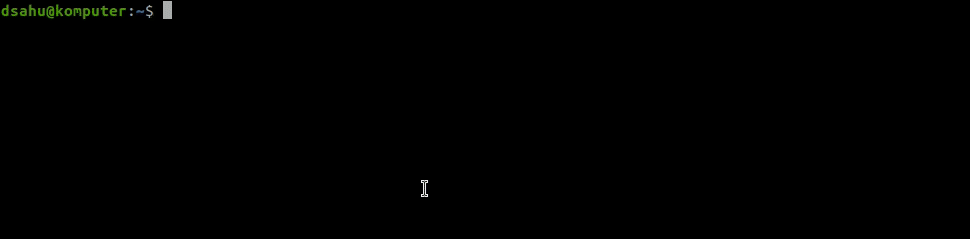

# ros-curses

`ros-curses` is a command line interface for debugging live [ROS](https://www.ros.org/) applications. It is based on [ncurses](https://en.wikipedia.org/wiki/Ncurses). This project was prompted by the frustration of the author in repeatedly running successive commands like `rostopic info ...`, `rosnode info -q ...`, etc.

### Installation

Despite the fact that this tool interfaces with ROS, the number of dependencies are quite light. In addition to `ncurses` we also use [xmlrpc](http://xmlrpc.com/) for ROS querying. To install all required dependencies run the following (or equivalent on your OS):

```bash
apt install cmake libxmlrpcpp-dev libncurses-dev libyaml-cpp-dev
```

That's it! To build, run the following:

```bash
# build the package
mkdir build -p && cd build
cmake .. && make

# install, if desired
sudo make install
```

### Saving and Loading

Several executables are also provided for more convenient offline inspection. One script (`save-state`) will dump the current ROS state to a YAML file for future inspection.

```bash
# will error out if no ROS instance is detected
./save-state FILENAME
```

Then, that state can be interactively analyzed offline at your leisure via `load-state`, which will open the full `curses` GUI loaded with the state saved in the YAML.

```bash
./load-state FILENAME
```

### Execution

Run the executable via `ros-curses` (or `./ros-curses` if not installed). The GUI should appear, and, if you have a live ROS instance running show something like the following:



There's also a `demo` which runs with a Mock ROS server as a backend. This highlights the ability of `ros-curses` to capture dynamic state changes, like a `roscore` dying or ROS parameter deletion.


### Notes

Currently only ROS1 is supported. I've architected things to make adding a ROS2 parser _somewhat_ easy, but some fundamental changes will be needed for representing the computational graph.

